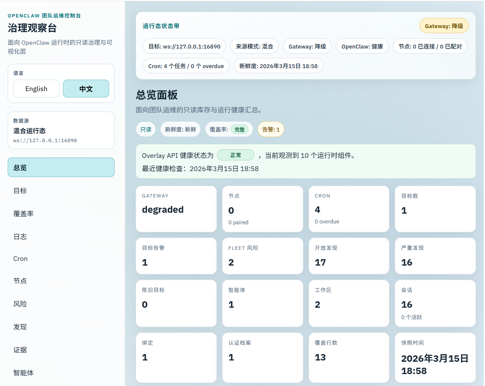

# OpenClaw Team Ops Console

**Read-only Governance and Visibility for OpenClaw runtimes**

## 中文

OpenClaw Team Ops Console 当前是一套面向内部评审的 **v0.3 alpha 治理预览版**：

- 独立运行，不依赖修改 OpenClaw core
- 严格只读，不提供写回、控制、终止、编辑、创建等能力
- 默认 `mock-first`
- 保持 `sidecar + overlay-api + overlay-web` 三层架构
- 把产品定位从“资源目录台”推进到“治理观察台”

### 界面预览 / UI Preview



当前截图展示的是接入本地 OpenClaw runtime 之后的 `Overview` 页面：左侧收口为运维主入口与可折叠的资源明细，右侧优先展示治理 KPI、最近活动与风险/目标摘要。

### 当前已经落地的能力

#### 治理层 (Governance Layer)
- `Targets`：目标注册表，支持单目标和 `SIDECAR_TARGETS_FILE` 多目标注册
- `Risks`：按严重级别、目标、类型聚合的风险视图
- `Findings`：发现清单，支持下钻到详情
- `Evidence`：标准化证据清单，支持 path / field 引用
- `Recommendations`：只读建议检查项，提供操作建议与验证步骤

#### 观察层 (Observation Layer)
- `Overview`：治理与运行状态总览
- `Fleet Map`：舰队拓扑与治理图，支持 Topology / Governance 视图切换
- `Coverage`：工作区文件与元数据覆盖分析
- `Activity`：统一事件时间线，聚合 Cron/Node/Session/Log 信号
- `Cron`：计划任务运行状态与历史记录
- `Nodes`：Gateway 节点拓扑与连接状态
- `Logs`：OpenClaw 原始日志浏览与解析
- `Agents`：Agent 资源汇总与 Workspace 分析
- `Workspaces`：工作区文件系统只读预览
- `Sessions`：会话列表、活跃时间与 Freshness
- `Bindings`：Channel 到 Agent 的路由绑定关系
- `Auth Profiles`：身份凭证摘要与来源
- `Topology`：资源关系拓扑图

### Navigation IA / 导航信息架构

**Primary operational views**

- Overview
- Fleet Map
- Activity
- Risks
- Findings
- Recommendations

**Resource detail views**

- Targets
- Coverage
- Logs
- Cron
- Nodes
- Evidence
- Agents
- Workspaces
- Sessions
- Bindings
- Auth Profiles
- Topology

### 页面 IA 对照表 (Information Architecture)

| 页面 (Page) | 路由 (Route) | 核心定位 (Positioning) | 数据源 (Data Source) | SSE 刷新 (SSE) |
|---|---|---|---|---|
| Overview | `/` | 治理与健康度总览 | Aggregated Summary | ✅ |
| Fleet Map | `/fleet-map` | 拓扑与治理可视化 | Fleet Layout | ✅ |
| Activity | `/activity` | 统一事件时间线 | Event Stream | ✅ |
| Risks | `/risks` | 风险聚合 | Derived Risks | - |
| Findings | `/findings` | 发现与审核 | Derived Findings | - |
| Recommendations | `/recommendations` | 运维建议 | Derived Recs | - |
| Targets | `/targets` | 目标管理 | System Snapshot | - |
| Coverage | `/coverage` | 覆盖率分析 | Collection Coverage | - |
| Logs | `/logs` | 原始日志 | Log Files | - |
| Cron | `/cron` | 计划任务 | Cron Runs | ✅ |
| Nodes | `/nodes` | Gateway 节点 | Gateway WS | ✅ |
| Evidence | `/evidence` | 证据链路 | Derived Evidence | - |
| Agents | `/agents` | Agent 资源 | Config + Runtime | ✅ |
| Workspaces | `/workspaces` | 文件系统预览 | Filesystem | - |
| Sessions | `/sessions` | 会话管理 | Session Store | - |
| Bindings | `/bindings` | 路由绑定 | Config | - |
| Auth Profiles | `/auth-profiles` | 身份凭证 | Auth JSON | - |
| Topology | `/topology` | 关系拓扑 | Aggregated Map | - |

#### 数据源层
- `mock`
  - 默认模式
  - 支持 `baseline`、`partial-coverage`、`stale-observability`、`error-upstream`
- `filesystem`
  - 只读扫描本地 OpenClaw runtime/config/workspace 路径
  - 缺失文件时以 `warnings + partial/unavailable + degraded` 方式降级
- `target registry`
  - 通过 `SIDECAR_TARGETS_FILE` 注册多个目标
  - 每个 target 可独立使用 `mock` 或 `filesystem` 数据源

### 当前读取模型（Read Model）

OpenClaw Team Ops Console 当前定位为 **OpenClaw 外部只读观察台**，不是第二个 Gateway，也不是写回控制面。

当前版本主要只读聚合五类状态：

| 类别 | 典型来源 | 当前用途 |
|---|---|---|
| Gateway / agent 配置 | `openclaw.json`、`OPENCLAW_CONFIG_PATH` 指向的配置、`$include` 引用文件 | 解析 agents、workspace、bindings、部分运行元数据 |
| Agent workspace | `workspace*` 下的 Markdown、`memory/`、`skills/` | 展示工作区构成、bootstrap 文件、目录覆盖情况、只读预览 |
| Agent runtime state | `agents/<agentId>/agent/`、`agents/<agentId>/sessions/`、legacy `sessions/` | 展示 auth profiles、sessions、freshness、拓扑关系 |
| Gateway runtime plane | `OPENCLAW_GATEWAY_URL` 指向的 Gateway WebSocket，以及 `openclaw.json` 中的 `gateway.auth.token` | 仅用 `role=operator` + `scopes=[operator.read]` 读取 `status`、`gateway.identity.get`、`system-presence`、`node.list`、`sessions.list`、`cron.list`、`cron.status`、`cron.runs`，补充 runtime status bar、nodes、cron 与 live presence；shared token 会优先从 `openclaw.json` 自动解析 |
| OpenClaw logs | `OPENCLAW_LOG_GLOB`、`logging.file`、默认 `/tmp/openclaw/openclaw-YYYY-MM-DD.log` | 展示最近日志、按日期查看、只读解析 disconnect / cron / plugin / session 信号 |

说明：

- 当前项目只做 **read-only inventory / snapshot / derived warnings**
- 当前项目 **不会写回** OpenClaw config、workspace、session store、auth profile
- 当前项目 **不会执行** `bind / unbind / create / delete / restart / stop / reset` 等控制动作

### 当前实际读取的文件与目录

当前 `filesystem` adapter 主要读取以下对象：

#### A. OpenClaw config
- `${OPENCLAW_CONFIG_FILE}`
- `${OPENCLAW_CONFIG_PATH}`
- `<stateDir>/openclaw.json`
- `<stateDir>/clawdbot.json`
- `<stateDir>/moldbot.json`
- `<stateDir>/moltbot.json`
- 读取目的：
  - 解析 `agents.defaults.workspace`
  - 解析 `agents.list[].id`
  - 解析 `agents.list[].name`
  - 解析 `agents.list[].workspace`
  - 解析 `agents.list[].agentDir`
  - 解析 `bindings`
  - 解析 `session.store`
  - 递归解析 `$include`

#### B. Agent runtime state
- `<stateDir>/agents/<agentId>/agent/auth-profiles.json`
  - 用于只读展示 auth profile 数量、provider、状态摘要
- `<stateDir>/agents/<agentId>/sessions/sessions.json`
  - 用于只读展示 session 列表、活跃时间、归属 agent、freshness
- `<stateDir>/sessions/sessions.json`
  - 当前版本只用于官方文档中 main/default agent 的 legacy 兼容回退
- `<stateDir>/agents/<agentId>/sessions/*.jsonl`
  - 当前版本**不读取 transcript 内容**
  - 当前只使用 `sessions.json` 元数据，不做 transcript 级浏览

#### C. OpenClaw logs
- `${OPENCLAW_LOG_GLOB}`
- `openclaw.json.logging.file`
- `/tmp/openclaw/openclaw-YYYY-MM-DD.log`
- 读取目的：
  - 只读发现最近日志文件与历史日期
  - 解析 timestamp / level / subsystem / refs
  - 聚合 disconnect / cron / plugin / session 等信号
  - 展示 raw line，不删除、不 follow、不写回

#### D. OpenClaw cron
- `<stateDir>/cron/jobs.json`
  - 用于只读展示 cron jobs、schedule、enabled、next run、last run、overdue
- `<stateDir>/cron/runs/*.jsonl`
  - 用于只读展示 recent runs、run state、summary 和 evidence refs
  - 仅解析最近运行记录，不修复 schema、不写回状态

#### E. Agent workspace
当前版本会识别以下常见文件 / 目录：
- `${workspace}/AGENTS.md`
- `${workspace}/SOUL.md`
- `${workspace}/TOOLS.md`
- `${workspace}/BOOTSTRAP.md`
- `${workspace}/BOOT.md`
- `${workspace}/IDENTITY.md`
- `${workspace}/USER.md`
- `${workspace}/HEARTBEAT.md`
- `${workspace}/MEMORY.md`
- `${workspace}/memory.md`
- `${workspace}/memory/`
- `${workspace}/skills/`

说明：

- 所有读取均为只读扫描，不创建、不修改、不删除任何文件
- 缺失文件不会自动补齐，只会在快照中表现为 `warning`、`partial` 或 `unavailable`
- `BOOT.md` 是 OpenClaw 官方 workspace 文件，当前版本已经纳入 inventory / preview 读取
- `OPENCLAW_SOURCE_ROOT` 仅用于展示来源元信息，不会 import 或执行 OpenClaw 源码

### 菜单功能与代码透明

当前导航按“读什么、展示什么、不做什么”来理解：

| 菜单 | 主要读取对象 | 主要用途 | 明确不做 |
|---|---|---|---|
| Overview | 聚合快照 | 总览健康度、计数、warnings、freshness | 不执行任何控制操作 |
| Targets | 派生对象清单 | 展示治理/观察目标的集合视图 | 不创建、不编辑目标 |
| Risks | 派生风险项 | 展示 dangling / stale / missing / degraded 等只读风险 | 不自动修复 |
| Findings | 派生发现项 | 将风险、状态与建议整理为只读 findings | 不下发治理动作 |
| Evidence | 只读证据对象 | 展示 findings 对应的证据与上下文 | 不修改证据源 |
| Logs | OpenClaw 日志文件 | 展示最近日志、按日期检索、查看原始行与解析 refs | 不删除日志、不 follow、不发送告警 |
| Agents | config + runtime | agent 列表、workspace、auth、session 汇总 | 不创建/删除 agent |
| Workspaces | workspace files | bootstrap 文件、memory/skills 目录、只读预览 | 不编辑任何 Markdown |
| Sessions | session store | 展示 session 列表、最后活动时间、freshness | 不 reset / prune / send |
| Bindings | config bindings | 渠道与 agent 的绑定关系 | 不 bind / unbind |
| Auth Profiles | `auth-profiles.json` | 展示 profile 数量、来源、状态摘要 | 不登录、不刷新 token |
| Topology | 聚合关系 | 展示 config / workspace / sessions / bindings 的关系图 | 不调度、不路由 |

### 代码透明与非目标

本项目的核心价值不是“替代 OpenClaw”，而是：

- 在 **不修改 OpenClaw core** 的前提下提供外部可观察性
- 通过 **sidecar + overlay-api + overlay-web** 三层架构输出稳定只读快照
- 将“当前读了什么、没读什么、不会做什么”公开写清楚

本项目当前明确 **不会**：

- 不写回 `openclaw.json`
- 不写回 workspace Markdown
- 不写回 `auth-profiles.json`
- 不写回 `sessions.json`
- 不执行 `create / edit / delete / bind / unbind / restart / stop / reset`
- 不替代 OpenClaw 官方 dashboard / gateway / chat UI

#### 本项目明确会做的事
- 只读扫描 OpenClaw 外部状态
- 聚合成稳定的 `SystemSnapshot`
- 通过 GET-only API 和只读 Web UI 展示
- 对缺失、陈旧、不一致状态输出 `warning`、`partial`、`freshness`

#### 本项目明确不会做的事
- 不修改 OpenClaw core
- 不 import OpenClaw 内部源码模块
- 不写回 `openclaw.json`
- 不写回 workspace Markdown
- 不写回 `auth-profiles.json`
- 不写回 `sessions.json`
- 不执行 `bind / unbind / create / delete / stop / restart`
- 不作为 chat UI，不替代 official dashboard
- 不 patch / fork / vendor / runtime injection

### 为什么是 Governance，不是 Control

本仓库关注的是：

- 哪些 target 存在风险
- 风险来自哪些证据
- 哪些数据不完整、已过期、或存在解析异常
- 人应该去检查什么

本仓库**不做**：

- 写本地文件
- 调 OpenClaw 写接口
- 终止会话 / 重启 agent / 应用配置
- chat UX、prompt 编辑、执行控制
- patch / fork / vendor / runtime injection

### 架构概览

```text
OpenClaw runtime or mock data
        |
        v
     sidecar
        |
        v
    overlay-api
        |
        v
    overlay-web
```

### 5-Minute Demo Path / 5分钟演示路径

我们推荐按以下顺序通过控制台进行功能演示，以完整体验“从观测到治理”的闭环：

1.  **Overview (`/`)**：先看 Gateway 状态、治理优先级卡片与最近活动。
2.  **Fleet Map (`/fleet-map`)**：查看 Host/Workspace/Agent 拓扑关系与治理染色。
3.  **Activity (`/activity`)**：查看聚合了 Cron/Node/Log 的统一事件时间轴。
4.  **Risks (`/risks`) → Findings (`/findings`) → Recommendations (`/recommendations`)**：沿着只读治理链路完成风险排查、发现核查与建议检查。

详细演示脚本请参考 [docs/demo-walkthrough.md](docs/demo-walkthrough.md)。

---

### 快速启动

```bash
corepack pnpm install
cp .env.example .env
corepack pnpm dev
```

`.env.example` 现在就是唯一的默认入口（已内置详尽的中英文说明与开箱即用的默认值）：直接复制后可跑 `mock-first` 并体验完整的控制台展示，想接真实 OpenClaw runtime 时只需要把 `OPENCLAW_STATE_DIR=/path/to/your/.openclaw` 改成你的本地路径。更详细的说明见 [docs/env.md](docs/env.md)。

默认本地地址：

- Overlay Web: `http://localhost:5173`
- Overlay API: `http://localhost:4300`
- Sidecar: `http://localhost:4310`

如果你想把前端改到 `9527`，可在 `.env` 中设置：

```env
OVERLAY_WEB_PORT=9527
```

### Docker Compose 启动

当前仓库提供两套 compose：

- `docker-compose.yml`
  - 继续作为 **mock-first demo compose**
  - 不挂载真实 OpenClaw 运行目录
- `docker-compose.filesystem.yml`
  - 用于 **真实 OpenClaw 只读接线 compose**
  - 通过只读 bind mount 挂载宿主机 OpenClaw state 目录
  - sidecar 在容器内固定读取 `OPENCLAW_STATE_DIR=/openclaw-state`
  - config 和 workspace 默认都从这个 state dir 自动推导
  - 容器内会显式绑定 `0.0.0.0`，保证 sidecar 和 overlay-api 可在容器网络中互通

非 Docker 部署建议：

- `9527` 可对外提供访问
- `4300` 和 `4310` 默认仅绑定 `127.0.0.1`
- `VITE_OVERLAY_API_URL` 保持为空，优先走同源 `/api` 代理，避免浏览器直接访问 `4300`

mock-first demo compose：

```bash
docker compose up --build
```

filesystem 只读 compose：

```bash
cp .env.example .env
# 先把 OPENCLAW_STATE_DIR 改成你的真实 OpenClaw 路径
docker compose -f docker-compose.filesystem.yml up --build
```

环境变量模板和规则说明见 [docs/env.md](docs/env.md)。

停止：

```bash
docker compose -f docker-compose.filesystem.yml down --remove-orphans
```

### 环境变量与模式说明

- `.env.example`：唯一默认模板（内附中英文配置说明与开箱即用的默认演示值）
- `OPENCLAW_STATE_DIR`：改成真实路径后切到 filesystem 只读模式；保留 `/path/to/your/.openclaw` 则继续走 mock
- `SIDECAR_TARGETS_FILE`：多 target 注册表入口
- 更多变量说明见 [docs/env.md](docs/env.md)
- 多 target 示例文件见 [examples/targets.registry.example.json](examples/targets.registry.example.json)

### 当前主要页面

Primary operational views

- `/`
- `/fleet-map`
- `/activity`
- `/risks`
- `/findings`
- `/recommendations`

Resource detail views

- `/targets`
- `/coverage`
- `/logs`
- `/cron`
- `/nodes`
- `/evidence`
- `/agents`
- `/workspaces`
- `/sessions`
- `/bindings`
- `/auth-profiles`
- `/topology`

Detail routes

- `/targets/:id`
- `/cron/:id`
- `/findings/:id`
- `/evidence/:id`
- `/recommendations/:id`

### 当前主要只读 API

- `GET /health`
- `GET /api/summary`
- `GET /api/targets`
- `GET /api/targets/:id`
- `GET /api/targets/:id/summary`
- `GET /api/evidence`
- `GET /api/evidence/:id`
- `GET /api/findings`
- `GET /api/findings/:id`
- `GET /api/recommendations`
- `GET /api/recommendations/:id`
- `GET /api/risks/summary`
- `GET /api/agents`
- `GET /api/agents/:id`
- `GET /api/workspaces`
- `GET /api/workspaces/:id/documents/:fileName`
- `GET /api/sessions`
- `GET /api/bindings`
- `GET /api/auth-profiles`
- `GET /api/topology`
- `GET /api/runtime-status`
- `GET /api/cron`
- `GET /api/cron/:id`
- `GET /api/nodes`

### v0.3 scope

v0.3 当前聚焦：

- Target Registry
- Evidence / Findings / Risks 治理链路
- Recommendation 建议式运维
- 多目标只读观察
- Cron 只读观察
- Gateway / OpenClaw / Nodes runtime plane 可视化
- 保持 mock + filesystem 两类基础模式

### non-goals

- 不做真实写操作
- 不做业务型 `POST / PUT / PATCH / DELETE`
- 不做 chat 前端
- 不做审批流
- 不做 RBAC 落地
- 不做远程执行
- 不通过前端或 sidecar 写本地文件

### 质量检查

```bash
corepack pnpm guard:readonly
corepack pnpm typecheck
corepack pnpm test
corepack pnpm playwright:install
corepack pnpm test:e2e
corepack pnpm build
corepack pnpm check
```

filesystem compose 配置校验：

```bash
docker compose -f docker-compose.filesystem.yml config
```

### 文档索引

- [docs/architecture.md](docs/architecture.md)
- [docs/api-contract.md](docs/api-contract.md)
- [docs/deployment-local.md](docs/deployment-local.md)
- [docs/local-path-integration.md](docs/local-path-integration.md)
- [docs/mock-scenarios.md](docs/mock-scenarios.md)
- [docs/roadmap-v0.3.md](docs/roadmap-v0.3.md)
- [docs/why-governance-not-control.md](docs/why-governance-not-control.md)
- [docs/v0.3-changelog.md](docs/v0.3-changelog.md)
- [docs/v0.3-api-examples.md](docs/v0.3-api-examples.md)
- [docs/v0.3-demo-scenarios.md](docs/v0.3-demo-scenarios.md)
- [docs/v0.3-known-limitations.md](docs/v0.3-known-limitations.md)
- [docs/v0.3-information-architecture.md](docs/v0.3-information-architecture.md)
- [docs/v0.3-governance-flow.md](docs/v0.3-governance-flow.md)
- [docs/v0.3-dto-changes.md](docs/v0.3-dto-changes.md)
- [docs/v0.3-api-changes.md](docs/v0.3-api-changes.md)
- [docs/v0.3-validation-log.md](docs/v0.3-validation-log.md)
- [docs/v0.3-acceptance-checklist.md](docs/v0.3-acceptance-checklist.md)
- [docs/setup-5-minutes.md](docs/setup-5-minutes.md)
- [docs/readonly-guarantees.md](docs/readonly-guarantees.md)

### 已知限制

- 当前仍是内部 alpha / preview 形态
- `gateway-ws` 当前通过 `operator.read` 补全核心读面，支持 `node.list / cron.runs / system.presence`
- runtime plane 已接入 **SSE (Server-Sent Events)**，支持 bootstrap/cron/nodes/activity 实时更新
- 当前浏览器级 E2E 已覆盖 runtime status、cron、nodes、治理全链路

---

## English

OpenClaw Team Ops Console currently ships as a **v0.3 alpha governance preview** for internal evaluation:

- standalone, with no OpenClaw core changes required
- strictly read-only
- mock-first by default
- still built as `sidecar + overlay-api + overlay-web`
- moving from an inventory console toward a governance and visibility console

### What is implemented today

#### Governance layer
- `Targets` for target registry and fleet visibility
- `Risks` for aggregated governance signals
- `Findings` for detailed issue review and drill-down
- `Evidence` for normalized, traceable evidence records
- `Recommendations` for read-only suggested checks and validation steps

#### Observation layer
- `Overview`: Governance and runtime status dashboard
- `Fleet Map`: Interactive topology and governance overlay
- `Coverage`: Workspace file and metadata coverage analysis
- `Activity`: Unified event timeline aggregating Cron, Node, Session, and Log signals
- `Cron` for scheduled jobs and historical runs
- `Nodes` for gateway node topology and connectivity
- `Logs` for OpenClaw log browsing and parsing
- `Agents`: Agent inventory and workspace analysis
- `Workspaces`: Read-only file system previews
- `Sessions`: Session inventory and freshness tracking
- `Bindings`: Channel-to-agent routing relationships
- `Auth Profiles`: Identity profile summaries
- `Topology`: Resource relationship graph

#### Source layer
- `mock` remains the default mode
- `filesystem` reads local OpenClaw runtime paths in read-only mode
- `SIDECAR_TARGETS_FILE` enables multiple registered targets, each with its own source configuration

### Navigation IA

**Primary operational views**

- Overview
- Fleet Map
- Activity
- Risks
- Findings
- Recommendations

**Resource detail views**

- Targets
- Coverage
- Logs
- Cron
- Nodes
- Evidence
- Agents
- Workspaces
- Sessions
- Bindings
- Auth Profiles
- Topology

### Current Read Model

OpenClaw Team Ops Console is positioned as an **external read-only OpenClaw observability console**. It is not a second Gateway and it is not a write-back control plane.

The current release aggregates four classes of state in read-only mode:

| Category | Typical sources | Current purpose |
|---|---|---|
| Gateway / agent config | `openclaw.json`, the path from `OPENCLAW_CONFIG_PATH`, and `$include` references | Parse agents, workspaces, bindings, and selected runtime metadata |
| Agent workspace | Markdown files plus `memory/` and `skills/` under `workspace*` directories | Show workspace structure, bootstrap coverage, directory coverage, and read-only previews |
| Agent runtime state | `agents/<agentId>/agent/`, `agents/<agentId>/sessions/`, and legacy `sessions/` | Show auth profiles, sessions, freshness, and topology relationships |
| Runtime plane | Gateway read-only RPC plus filesystem cron state | Show gateway connectivity, nodes, cron observability, runtime status bar, and live freshness |

Notes:

- the project only produces **read-only inventory / snapshots / derived warnings**
- it does **not** write back OpenClaw config, workspaces, session stores, or auth profiles
- it does **not** execute `bind / unbind / create / delete / restart / stop / reset` control actions

### Files And Directories Currently Read

The current `filesystem` adapter primarily reads the following objects:

#### A. OpenClaw config
- `${OPENCLAW_CONFIG_FILE}`
- `${OPENCLAW_CONFIG_PATH}`
- `<stateDir>/openclaw.json`
- `<stateDir>/clawdbot.json`
- `<stateDir>/moldbot.json`
- `<stateDir>/moltbot.json`
- Read purposes:
  - parse `agents.defaults.workspace`
  - parse `agents.list[].id`
  - parse `agents.list[].name`
  - parse `agents.list[].workspace`
  - parse `agents.list[].agentDir`
  - parse `bindings`
  - parse `session.store`
  - recursively resolve `$include`

#### B. Agent runtime state
- `<stateDir>/agents/<agentId>/agent/auth-profiles.json`
  - used for read-only auth-profile counts, provider hints, and status summaries
- `<stateDir>/agents/<agentId>/sessions/sessions.json`
  - used for read-only session inventory, activity times, agent ownership, and freshness
- `<stateDir>/sessions/sessions.json`
  - currently used only as the documented legacy fallback for the main/default agent
- `<stateDir>/agents/<agentId>/sessions/*.jsonl`
  - the current version does **not** read transcript contents
  - this release only uses `sessions.json` metadata

#### C. OpenClaw cron
- `<stateDir>/cron/jobs.json`
  - used for read-only cron jobs, schedules, enabled state, next run, last run, and overdue detection
- `<stateDir>/cron/runs/*.jsonl`
  - used for read-only recent runs, run states, summaries, and evidence refs

#### D. Agent workspace
The current version recognizes these common files and directories:
- `${workspace}/AGENTS.md`
- `${workspace}/SOUL.md`
- `${workspace}/TOOLS.md`
- `${workspace}/BOOTSTRAP.md`
- `${workspace}/BOOT.md`
- `${workspace}/IDENTITY.md`
- `${workspace}/USER.md`
- `${workspace}/HEARTBEAT.md`
- `${workspace}/MEMORY.md`
- `${workspace}/memory.md`
- `${workspace}/memory/`
- `${workspace}/skills/`

Notes:

- all reads are read-only scans; no files are created, modified, or deleted
- missing files are never auto-healed; they surface as `warning`, `partial`, or `unavailable`
- `BOOT.md` is an official OpenClaw workspace file and is included in the current inventory / preview path
- `OPENCLAW_SOURCE_ROOT` is informational metadata only and is never imported or executed

### Menu Transparency

Read the current navigation as “what it reads, what it shows, and what it will not do”:

| Menu | Primary read objects | Main purpose | Explicitly does not do |
|---|---|---|---|
| Overview | aggregated snapshot | overall health, counts, warnings, freshness | no control operations |
| Cron | cron store + gateway runtime plane | scheduled jobs, recent runs, overdue signals | no run / disable / edit |
| Nodes | gateway runtime plane | paired / connected / stale node visibility | no reconnect / invoke |
| Targets | derived target inventory | governance / observability target list | no target create or edit |
| Risks | derived risk items | dangling / stale / missing / degraded read-only risks | no auto-remediation |
| Findings | derived finding items | organize risk, status, and guidance into read-only findings | no downstream governance action |
| Evidence | read-only evidence objects | evidence and context behind findings | no evidence-source mutation |
| Agents | config + runtime | agent inventory, workspace, auth, and session rollups | no agent create/delete |
| Workspaces | workspace files | bootstrap files, memory/skills directories, read-only preview | no Markdown editing |
| Sessions | session store | session inventory, latest activity, freshness | no reset / prune / send |
| Bindings | config bindings | channel-to-agent routing relationships | no bind / unbind |
| Auth Profiles | `auth-profiles.json` | profile counts, origins, status summaries | no login or token refresh |
| Topology | aggregated relationships | relationships across config, workspaces, sessions, and bindings | no scheduling or routing |

### Transparency And Non-goals

The core value of this project is not to replace OpenClaw. It is to:

- provide external observability **without modifying OpenClaw core**
- expose stable read-only snapshots through the **sidecar + overlay-api + overlay-web** architecture
- make “what we read, what we do not read, and what we will not do” explicit in public docs

This project currently **does not**:

- write back `openclaw.json`
- write back workspace Markdown
- write back `auth-profiles.json`
- write back `sessions.json`
- execute `create / edit / delete / bind / unbind / restart / stop / reset`
- replace the official OpenClaw dashboard / gateway / chat UI

#### This project explicitly does
- read external OpenClaw state in read-only mode
- normalize that state into a stable `SystemSnapshot`
- expose it through GET-only APIs and a read-only web UI
- surface missing, stale, or inconsistent state as `warning`, `partial`, and freshness metadata

#### This project explicitly does not do
- modify OpenClaw core
- import internal OpenClaw source modules
- write back `openclaw.json`
- write back workspace Markdown
- write back `auth-profiles.json`
- write back `sessions.json`
- execute `bind / unbind / create / delete / stop / restart`
- act as a chat UI or replace the official dashboard
- patch, fork, vendor, or inject into the OpenClaw runtime

### Why governance, not control

This repository is designed to answer:

- which targets look risky
- what evidence supports that judgment
- where data is partial, stale, or unavailable
- what an operator should inspect next

This repository does **not**:

- mutate OpenClaw state
- expose write-oriented endpoints
- provide chat UX or execution control
- patch, fork, vendor, or inject into OpenClaw runtime

### Quickstart

```bash
corepack pnpm install
cp .env.example .env
corepack pnpm dev
```

`.env.example` is now the one default entrypoint (featuring detailed bilingual instructions and out-of-the-box default values): copy it and you get a complete `mock-first` startup, then replace `OPENCLAW_STATE_DIR=/path/to/your/.openclaw` only when you want real local OpenClaw data. More detail lives in [docs/env.md](docs/env.md)。.

Default local URLs:

- Overlay Web: `http://localhost:5173`
- Overlay API: `http://localhost:4300`
- Sidecar: `http://localhost:4310`

### Docker Compose startup

The repository now ships with two compose files:

- `docker-compose.yml`
  - remains the **mock-first demo compose**
  - does not mount a real OpenClaw runtime
- `docker-compose.filesystem.yml`
  - is the **real OpenClaw read-only integration compose**
  - mounts the host OpenClaw state directory as a read-only bind mount
  - pins the container-side state dir to `OPENCLAW_STATE_DIR=/openclaw-state`
  - derives config and workspace defaults from that mounted state dir

Mock-first demo compose:

```bash
docker compose up --build
```

Filesystem read-only compose:

```bash
cp .env.example .env
# replace OPENCLAW_STATE_DIR with your real local OpenClaw path first
docker compose -f docker-compose.filesystem.yml up --build
```

See [docs/env.md](docs/env.md) for the single-template rules and derived defaults.

Stop:

```bash
docker compose -f docker-compose.filesystem.yml down --remove-orphans
```

### Env templates and mode selection

- `.env.example`: the single default template (includes bilingual comments and out-of-the-box defaults)
- `OPENCLAW_STATE_DIR`: switch to real read-only filesystem mode by replacing the placeholder path
- `SIDECAR_TARGETS_FILE`: multi-target registry mode
- the rest of the env rules are documented in [docs/env.md](docs/env.md)

### Quality gates

```bash
corepack pnpm playwright:install
corepack pnpm test:e2e
corepack pnpm check
```

Filesystem compose config check:

```bash
docker compose -f docker-compose.filesystem.yml config
```

### Browser E2E

The repository now includes one minimal browser-level E2E that validates the read-only governance flow with the `partial-coverage` mock fixture:

`Risks -> Finding Detail -> Evidence -> Recommendation`

It asserts:

- key page text is present
- evidence records are present
- recommendations are present
- the flow remains read-only

Current test name:

- `browser e2e: mock governance flow stays read-only from risks to finding detail, evidence, and recommendations`

On Linux/WSL, `corepack pnpm test:e2e` automatically prepares a small local library bundle for Playwright Chromium when system libraries are missing.

### Current non-goals

- write operations
- business `POST / PUT / PATCH / DELETE`
- chat UX
- remote execution
- RBAC rollout
- approval workflows

### Known limitations

- v0.3 alpha / governance preview only
- filesystem remains the base adapter; gateway-ws now augments the runtime plane with read-only `operator.read`
- runtime plane integrated with **SSE (Server-Sent Events)** for real-time bootstrap/cron/nodes/activity updates
- browser E2E now covers runtime status, cron, nodes, and governance flow
